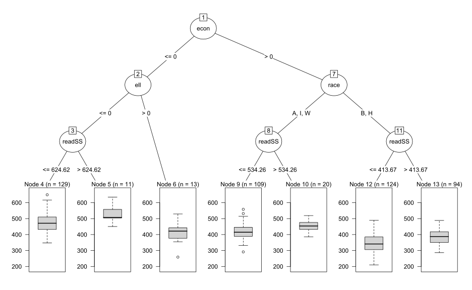

% Strategies and Structures for Improving Data Use - An SEA Perspective
% Presentation to the SDP Summer Institute for Leadership in Analytics August 6th-8th 2012
% Jared Knowles, Policy Research Advisor at Wisconsin Department of Public Instruction


# Opening


```r
library(partykit)
mypar <- ctree_control(testtype = "Bonferroni", mincriterion = 0.99)
mytree <- ctree(mathSS ~ race + econ + ell + disab + sch_fay + dist_fay + attday + 
    readSS, data = subset(df, grade == 3))
plot(mytree)
```

 


# Testing Image

<p align="center"></p>

# Attribution and License
<p xmlns:dct="http://purl.org/dc/terms/">
<a rel="license" href="http://creativecommons.org/publicdomain/mark/1.0/">

</a>
<br />
This work (<span property="dct:title">Data Analysis in an SEA</span>, by <a href="www.jaredknowles.com" rel="dct:creator"><span property="dct:title">Jared E. Knowles</span></a>), in service of the <a href="http://www.dpi.wi.gov" rel="dct:publisher"><span property="dct:title">Wisconsin Department of Public Instruction</span></a>, is free of known copyright restrictions.
</p>
